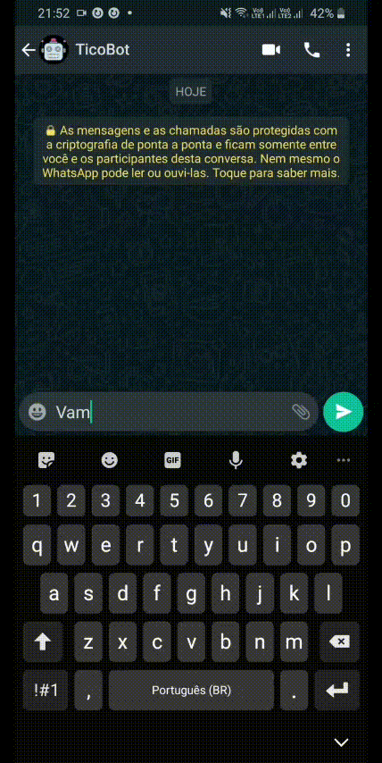

# TicoBot Whatsapp

Esta é uma prova de conceitos utlizando a biblioteca [venom](https://github.com/orkestral/venom).

Motivações: 
* desenvolver um bot para whatsapp baseado em menus definidos para automatizar processos que antes eram realizados por pessoas.
* através da biblioteca [venom](https://github.com/orkestral/venom) temos o total controle para definir integrações com SGBD's, por exemplo e definir uma própria arquitetura - não dependendo de api's de terceiros. 

# Como o venom funciona
Ele realiza um scraping do whatsapp e te dar através de suas interfaces tudo que você precisa. 

## Demo

    

